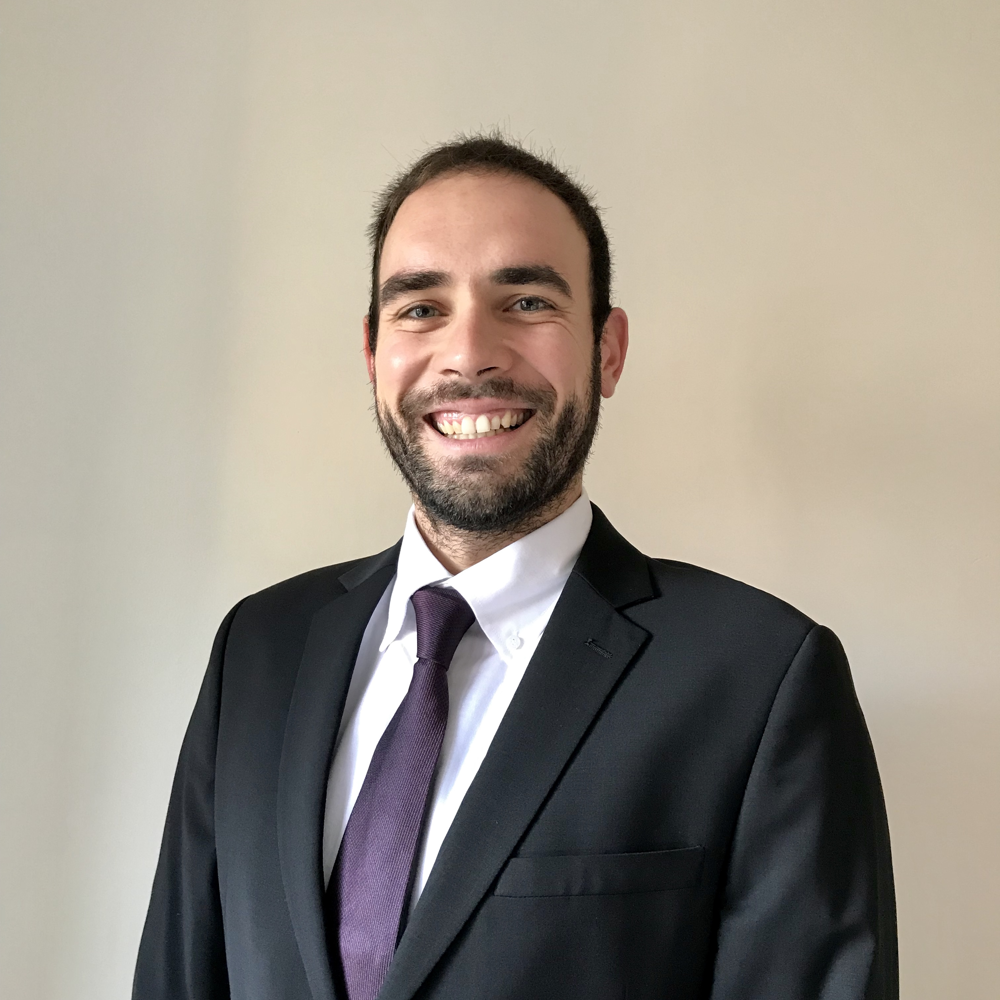

<link rel="stylesheet" href="styles.css" type="text/css">

I obtained my Economics PhD degree from the New School for Social Research in May 2021. My research interests lie in economic growth, macroeconomics stabilization policies and climate macroeconomics. In particular, I am interested in analyzing the macroeconomic impact of climate policy reforms including carbon taxation, fuel subsidy reforms, and green public investment. I work on the econometric and model-based estimations of fiscal multipliers of developing economies to evaluate their green transition costs. Currently, I am working as a consultant at the Macroeconomics, Trade & Investment (MTI) Global Practice of the World Bank, located in Washington DC. 

